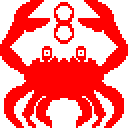

# CRAB-8

[![Try Me Badge][]][CRAB-8]

A CHIP-8 emulator written in Rust.

    

![Example Image][]

## Note

This project is still under active development and does not yet pass all the tests or run example software. _(But it's getting there)_

It's also not cleaned up and using idiomatic Rust, my goal is to get the project to MVP as quickly as possible and then take a cleanup pass later.

In these early stages, please don't provide unsolicited help or contributions, because this is first and foremost a learning project.  Once I'm happy with the result and make a `1.0` release, that goes out the window and I'll welcome contributions like any other project.

[CRAB-8]: https://crab8.estus.dev
[Example Image]: ./docs/images/example.png
[Try Me Badge]: https://img.shields.io/badge/try%20it-crab8.estus.dev-blue
